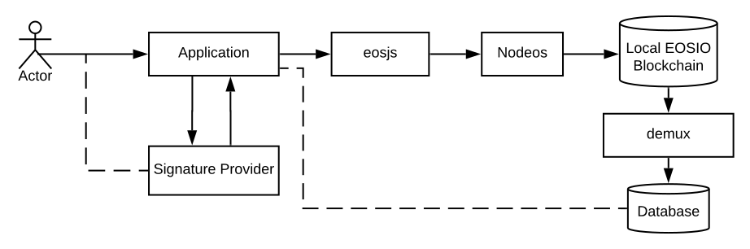

# 1.0 概览
## EOSIO 是什么?
EOSIO是一个引入区块链架构的软件，旨在实现去中心化应用程序（DAPP）的垂直和水平扩展，可部署成私有链或公有链。这是通过类似操作系统的构造来实现的，在这个构造上可以构建应用程序。该软件提供帐户、身份验证、数据库、异步通信以及跨多个CPU核心或集群的应用程序调度。由此产生的技术是一种区块链体系结构，它有潜力扩展到每秒数百万笔交易，消除用户费用，并允许快速、轻松地部署去中心化的应用程序。

## 技术特点

### C++/WASM虚拟机
EOSIO使用C++作为其智能合约编程语言。C++是世界各地开发人员普遍使用的编程语言。因此，任何熟悉C++的开发人员都不需要学习一种新的编程语言。一旦熟悉了EOSIO的API，开发人员将能够使用C++编写EOSIO智能合约。

底层的EOSIO是执行智能合约代码的WebAssembly(WASM)虚拟机，WASM也被谷歌、微软、苹果等公司开发的其他重要互联网基础设施软件所使用。使用WASM的设计选择使EOSIO能够重新使用经过优化和测试的编译器和工具链，这些编译器和工具链正被更广泛的社区维护和改进。此外，采用WASM标准还使编译器开发人员更容易将其他编程语言移植到EOSIO上。

### 高吞吐量和可扩展性
EOSIO旨在实现高交易吞吐量。使用委托权益证明（DPOS）的共识机制，EOSIO区块链网络不需要等待所有节点完成交易确认。与其他共识机制相比，这使得事务吞吐量更高。

### 更快的确认和更低的延迟
为了促进良好的用户体验，EOSIO被设计为具有低延迟的事务确认，以便开发人员构建的应用程序能够与非区块链、集中的、可替代的应用程序竞争。

### 可感知和成本可预测的区块链
基于EOSIO的应用程序可以采用免费增值模式，用户无需支付基础设施成本。用户无需支付交易费用。EOSIO区块链的独特之处在于，基础设施资源由一个标桩机制监管。基础设施资源基于相对于可用资源总量的标记，并且在标记被标记后被固定。这意味着，当代币已被押注时，基础设施资源的价格有效地“锁定”，因此不受特定基于EOSIO的区块链代币价格波动的影响。

### 综合权限架构
EOSIO有一个全面的权限系统，可以为各种用例创建自定义的权限模式。例如，您可以创建一个自定义权限，并使用它来保护智能合约的一个特定功能。您还可以将调用智能合约功能所需的权限拆分为具有不同权限权重的多个帐户。这个全面的许可系统允许开发人员在一个灵活的基础设施之上构建一个被许可的应用程序，而无需重新设计轮子。

### 可升级性
部署在基于EOSIO的区块链上的应用程序是可升级的。这意味着只要提供足够的权限，开发人员就可以部署代码修复、添加功能或更改应用程序逻辑。作为一个开发人员，你可以迭代你的应用程序，不会存在永久的bug。当然，也可以部署不能修改的智能合约。这些决定由开发人员自行决定，而不是受协议的限制。

### 能耗更低
与其他共识算法相比，DPOS作为共识机制，EOSIO在验证交易和确保区块链安全方面消耗的能量要少得多。

### 可编程经济与治理
任何基于EOSIO的区块链的资源分配和治理机制都是可编程的。治理和资源分配通过智能合约进行编程。开发人员只需修改系统智能合约，即可更改EOSIO区块链的资源分配和治理规则。在使用系统智能合约时，链上治理变得简单多了，因为不需要修改基础层代码，区块链上就可以进行更改。

## 技术栈

与EOSIO区块链的典型交互模式

### EOSIO.CDT
EOSIO.CDT 是一个用于WebAssembly（wasm）的工具链，也是一组用于帮助为EOSIO平台编写合约的工具集。除了作为一个通用的Webassembly工具链，EOSIO特定的优化还可以支持构建EOSIO智能合约。这个新的工具链是围绕clang 7构建的，这意味着EOSIO.cdt具有来自llvm的最新优化和解析。然而，由于WASM目标仍然被认为是实验性的，一些优化是不可用的或不完整的。

### Nodeos
nodeos是核心EOSIO节点守护进程，通过插件来配置nodeos以执行各种功能。nodeos处理所有对等网络、合约代码调度和区块链数据持久层。对于开发环境，nodeos也可用于建立单节点区块链网络。

### Cleos/Keosd
Keosd是EOSIO附带的EOSIO账户的主要管理。
Cleos是命令行工具，它使开发人员能够部署、测试和配置nodeos以及EOSIO智能合约。

与EOSIO Dapp的典型交互模式

### EOSJS
与EOSIO交互的javascript SDK，它封装了EOSIO RPC API。

### Demux
Demux是后端基础设施模式的参考实现，可用于将区块链事件从基于EOSIO的区块链路由到可查询的数据存储。